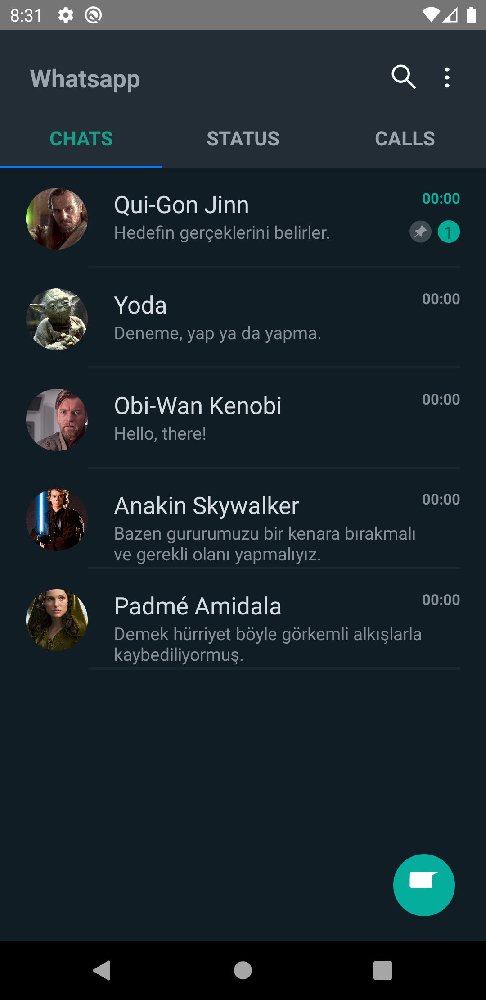

# Whatsapp Clone



[Projenin diğer fotoğraflarını görmek için buraya tıklayın..](https://github.com/ibrahimaykutbas/WhatsAppClone/tree/main/images)

## Teknoloji

React Native

## Tools

- React Navigation
- React Native Modal

## Özellikler

- Whatsapp UI Clone

## Kurulum

Bu depoyu yerel makinenizde klonlayın.

```
git clone https://github.com/ibrahimaykutbas/WhatsAppClone.git
```

### Hazırlık

Projeyi klonladıktan sonra ilgili dizine gidin.

```
cd patika-react-native/WhatsAppClone
code .
```
Proje bağımlılıklarını yüklemek için proje dizininde aşağıdaki komutları çalıştırın.

```
npm install
```

Eğer macOS kullanıyorsanız ve iOS işletim sistemine sahip bir cihazda projeyi başlatacaksanız pod'ları yükleyin.

```
cd ios
pod install
```

### Kullanım

Projeyi başlatmak için aşağıdaki komutları kullanın.

```
npx react-native run-android
--or--
npx react-native run-ios
```

Bu talimatlar, geliştirme ve test amacıyla yerel makinenizde projenin bir kopyasını hazır ve çalışır hale getirecektir.

## Daha Fazla Bilgi İçin

Daha fazlasını şuradan öğrenebilirsiniz: [React documentation](https://reactnative.dev/)
